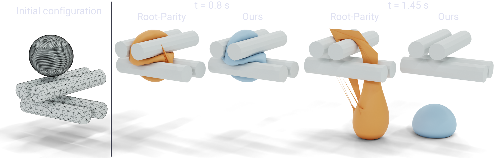
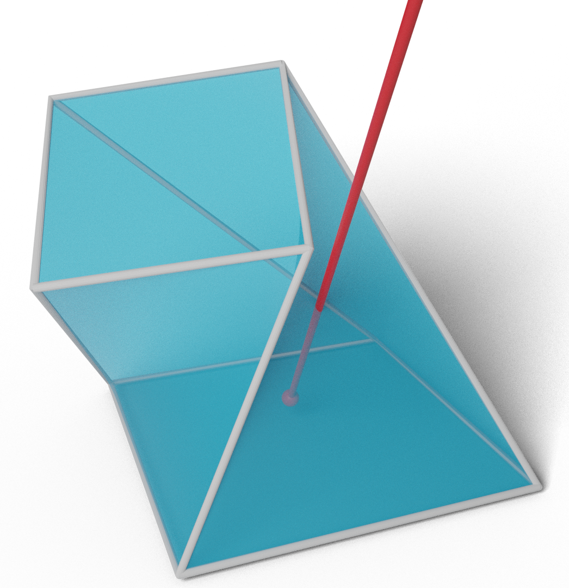

# Continuous Collision Detection

## Papers

### <a href="tight_inclusion">A Large Scale Benchmark and an Inclusion-Based Algorithm for Continuous Collision Detection</a>

Bolun Wang\*, Zachary Ferguson\*, Teseo Schneider, Xin Jiang, Marco Attene, Daniele Panozzo (\*Joint first authors)

 *ACM Transactions on Graphics 2021*

#### Abstract:

We introduce a large-scale benchmark for continuous collision detection (CCD) algorithms, composed of queries manually constructed to highlight challenging degenerate cases and automatically generated using existing simulators to cover common cases. We use the benchmark to evaluate the accuracy, correctness, and efficiency of state-of-the-art continuous collision detection algorithms, both with and without minimal separation.

We discover that, despite the widespread use of CCD algorithms, existing algorithms are either: (1) correct but impractically slow, (2) efficient but incorrect, introducing false negatives which will lead to interpenetration, or (3) correct but over conservative, reporting a large number of false positives which might lead to inaccuracies when integrated into a simulator.

By combining the seminal interval root-finding algorithm introduced by Snyder in 1992 with modern predicate design techniques, we propose a simple and efficient CCD algorithm. This algorithm is competitive with state-of-the-art methods in terms of runtime while conservatively reporting the time of impact and allowing an explicit trade-off between runtime efficiency and the number of false positives reported.

---

### <a href="root_parity">Fast and Exact Root Parity for Continuous Collision Detection</a>

Bolun Wang, Zachary Ferguson, Xin Jiang, Marco Attene, Daniele Panozzo, Teseo Schneider

*Computer Graphics Forum (Eurographics) 2022*

#### Abstract:

We introduce the first **exact** root parity counter for continuous collision detection (CCD). That is, our algorithm computes the parity (even or odd) of the number of roots of the cubic polynomial arising from a CCD query. We note that the parity is unable to differentiate between zero (no collisions) and the rare case of two roots (collisions).

Our method does not have numerical parameters to tune, has a performance comparable to efficient approximate algorithms, and is exact. We test our approach on a large collection of synthetic tests and real simulations, and we demonstrate that it can be easily integrated into existing simulators.

---

## Code

* [GitHub Organization](https://github.com/Continuous-Collision-Detection)
* [Wrapper and Benchmark](https://github.com/Continuous-Collision-Detection/CCD-Wrapper)
* [Novel Inclusion-Based CCD](https://github.com/Continuous-Collision-Detection/Tight-Inclusion)
* [Exact Root Parity CCD](https://github.com/Continuous-Collision-Detection/ExactRootParityCCD)
* Queries:
    * [Sample](https://github.com/Continuous-Collision-Detection/Sample-Queries)
    * [Full Dataset](https://archive.nyu.edu/handle/2451/61518)