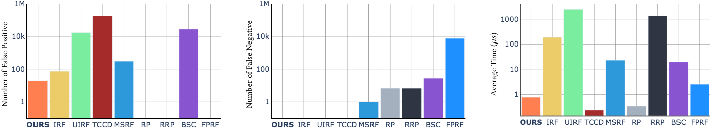

<style>
p {
    text-align: justify;
}
</style>


<center>
<h1>A Large Scale Benchmark and an Inclusion-Based Algorithm for Continuous Collision Detection</h1>

<h3 style="margin-bottom:0;">
<a href="https://github.com/wangbolun300">Bolun Wang</a><sup style="color:gray">*</sup>,
<a href="https://zferg.us">Zachary Ferguson</a><sup style="color:gray">*</sup>,
<a href="http://web.uvic.ca/~teseo/">Teseo Schneider</a>,
<a href="">Xin Jiang</a>,
<a href="https://www.cnr.it/en/people/marco.attene">Marco Attene</a>,
<a href="https://cims.nyu.edu/gcl/daniele.html">Daniele Panozzo</a>
</h3>
<div style="color:gray;text-align:center;font-size:10pt;">(<sup>*</sup>Joint first authors)</div>

<center>*ACM Transactions on Graphics, 2021*</center>
</center>


<figure>
    
    <figcaption style="margin:inherit 0; max-width:none; font-size:.8em; text-align: justify;">
        An overview of the results of our study of different CCD methods run on 60 million queries (both vertex-face and edge-edge). For each method, we show the number of false positives (i.e., the method detects a collision where there is none), the number of false negatives (i.e., the method misses a collision), and the average run time. Each plot reports results in a logarithmic scale. False positives and negatives are computed with respect to the ground truth computed using Mathematica [Wolfram Research Inc. 2020].
    </figcaption>
</figure>

---

## Paper

<b>
<a href="assets/A Large Scale Benchmark and an Inclusion-Based Algorithm for Continuous Collision Detection [Wang et al. 2021].pdf">Paper (PDF)</a>
&nbsp;&nbsp;&nbsp;&nbsp;&nbsp;
<a href="assets/A Large Scale Benchmark and an Inclusion-Based Algorithm for Continuous Collision Detection [Wang et al. 2021] (350ppi).pdf">Low res (PDF)</a>
&nbsp;&nbsp;&nbsp;&nbsp;&nbsp;
<!-- [arXiv](https://arxiv.org/abs/2009.13349) -->
</b>

## Abstract

We introduce a large scale benchmark for continuous collision detection (CCD) algorithms, composed of queries manually constructed to highlight challenging degenerate cases and automatically generated using existing simulators to cover common cases. We use the benchmark to evaluate the accuracy, correctness, and efficiency of state-of-the-art continuous collision detection algorithms, both with and without minimal separation.

We discover that, despite the widespread use of CCD algorithms, existing algorithms are either: (1) correct but impractically slow, (2) efficient but incorrect, introducing false negatives which will lead to interpenetration, or (3) correct but over conservative, reporting a large number of false positives which might lead to inaccuracies when integrated in a simulator.

By combining the seminal interval root finding algorithm introduced by Snyder in 1992 with modern predicate design techniques, we propose a simple and efficient CCD algorithm. This algorithm is competitive with state of the art methods in terms of runtime while conservatively reporting the time of impact and allowing explicit trade off between runtime efficiency and number of false positives reported.

## Video

<figure>
    <video width="100%" controls>
        <source src="assets/videos/roller-ball.mp4" type="video/mp4">
        Your browser does not support the video tag.
    </video>
    <figcaption style="margin:inherit 0; max-width:none; text-align: justify;">
        Inaccurate collision detection can lead to unnatural "sticking" and eventual failure when integrated into simulators (show here using <a href="https://ipc-sim.github.io">IPC [Li et al. 2020]</a>) because part of the geometry gets stuck inside. Here we show a false negative reported by the Root-Parity method of Brochu et al. [2012] causes the ball to get stuck inside the rollers. Our conservative CCD never misses collisions and so the ball can pass through the rollers without problems.
    </figcaption>
</figure>

## Source Code and Data

[](https://github.com/Continuous-Collision-Detection/CCD-Wrapper/actions?query=workflow%3ABuild+branch%3Amaster+event%3Apush)
[](https://github.com/Continuous-Collision-Detection/CCD-Wrapper/actions?query=workflow%3ANightly+branch%3Amaster+event%3Aschedule)
<a href="https://opensource.org/licenses/MIT"></img></a>

* [GitHub Organization](https://github.com/Continuous-Collision-Detection)
* [Wrapper and Benchmark](https://github.com/Continuous-Collision-Detection/CCD-Wrapper)
* [Novel Inclusion-Based CCD](https://github.com/Continuous-Collision-Detection/Tight-Inclusion)
* Queries:
    * [Sample](https://github.com/Continuous-Collision-Detection/Sample-Queries)
    * [Full Dataset](https://archive.nyu.edu/handle/2451/61518)

## BibTex

```bibtex
@article{Wang:2021:Benchmark,
	title   = {A Large Scale Benchmark and an Inclusion-Based Algorithm for Continuous Collision Detection},
	author  = {Bolun Wang and Zachary Ferguson and Teseo Schneider and Xin Jiang and Marco Attene and Daniele Panozzo},
	year    = 2021,
	journal = {ACM Transactions on Graphics}
}
```

## Acknowledgments

This work was partially supported by the NSF CAREER award under Grant No. 1652515, the NSF grants OAC-1835712, OIA-1937043, CHS-1908767, CHS-1901091, National Key Research and Development Program of China No. 2020YFA0713700, EU ERC Advanced Grant CHANGE No. 694515, a Sloan Fellowship, a gift from Adobe Research, a gift from nTopology, and a gift from Advanced Micro Devices, Inc.
