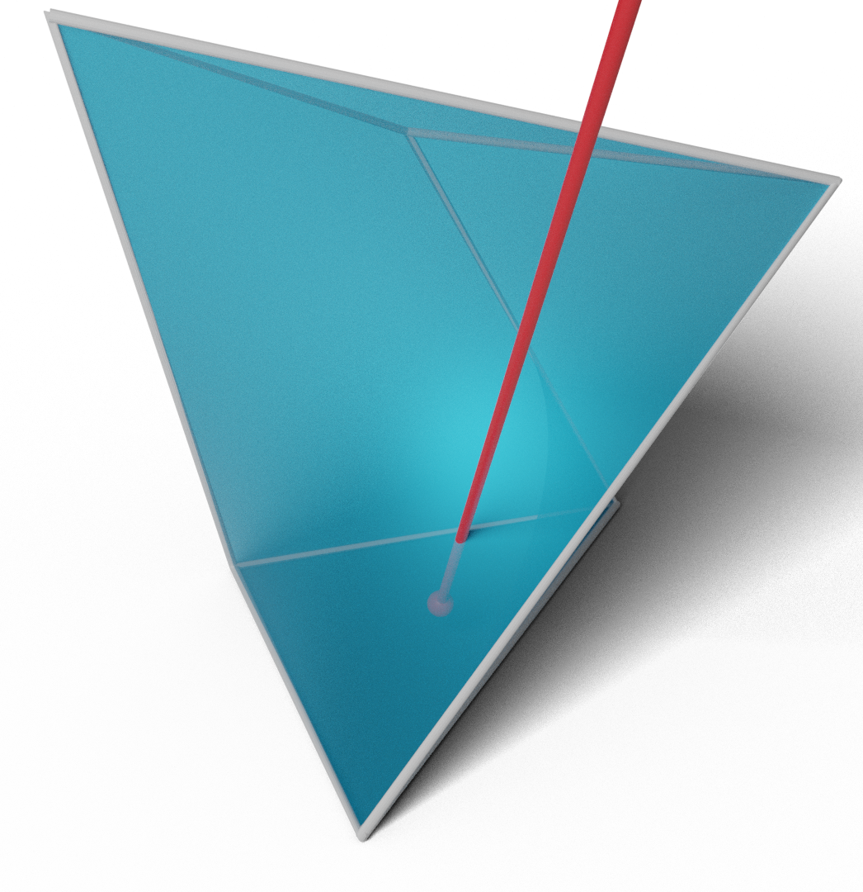

# Continuous Collision Detection

Welcome! This is the website for the Continuous Collision Detection (CCD) projects started at the [Geometric Computing Lab @ NYU](https://cims.nyu.edu/gcl/). The goal of this work is to provide provably correct and efficient algorithms for continuous collision detection and to provide large-scale benchmarks for evaluating the correctness and efficiency of future developments.

We have three papers on this topic, and the code for the algorithms and the benchmarks are available on [GitHub](https://github.com/continuous-collision-detection). Below you can find the abstracts for the papers, links to the papers, and links to the code repositories.

## Papers

### <a href="tight_inclusion">A Large Scale Benchmark and an Inclusion-Based Algorithm for Continuous Collision Detection</a>

Bolun&nbsp;Wang\*, Zachary&nbsp;Ferguson\*, Teseo&nbsp;Schneider, Xin&nbsp;Jiang, Marco&nbsp;Attene, Daniele&nbsp;Panozzo (\*Joint first authors)

 *ACM Transactions on Graphics 2021*

#### Abstract

We introduce a large-scale benchmark for continuous collision detection (CCD) algorithms, composed of queries manually constructed to highlight challenging degenerate cases and automatically generated using existing simulators to cover common cases. We use the benchmark to evaluate the accuracy, correctness, and efficiency of state-of-the-art continuous collision detection algorithms, both with and without minimal separation.

We discover that, despite the widespread use of CCD algorithms, existing algorithms are either: (1) correct but impractically slow, (2) efficient but incorrect, introducing false negatives which will lead to interpenetration, or (3) correct but over conservative, reporting a large number of false positives which might lead to inaccuracies when integrated into a simulator.

By combining the seminal interval root-finding algorithm introduced by Snyder in 1992 with modern predicate design techniques, we propose a simple and efficient CCD algorithm. This algorithm is competitive with state-of-the-art methods in terms of runtime while conservatively reporting the time of impact and allowing an explicit trade-off between runtime efficiency and the number of false positives reported.

---

### <a href="root_parity">Fast and Exact Root Parity for Continuous Collision Detection</a>

Bolun&nbsp;Wang, Zachary&nbsp;Ferguson, Xin&nbsp;Jiang, Marco &nbsp;Attene, Daniele&nbsp;Panozzo, Teseo&nbsp;Schneider

*Computer Graphics Forum (Eurographics) 2022*

#### Abstract

We introduce the first **exact** root parity counter for continuous collision detection (CCD). That is, our algorithm computes the parity (even or odd) of the number of roots of the cubic polynomial arising from a CCD query. We note that the parity is unable to differentiate between zero (no collisions) and the rare case of two roots (collisions).

Our method does not have numerical parameters to tune, has a performance comparable to efficient approximate algorithms, and is exact. We test our approach on a large collection of synthetic tests and real simulations, and we demonstrate that it can be easily integrated into existing simulators.

---

### <a href="scalable_ccd">Time of Impact Dataset for Continuous Collision Detection and a Scalable Conservative Algorithm</a>

David&nbsp;Belgrod, Bolun&nbsp;Wang, Zachary&nbsp;Ferguson, Xin&nbsp;Zhao, Marco&nbsp;Attene, Daniele&nbsp;Panozzo, Teseo&nbsp;Schneider

*In submission*

#### Abstract

We introduce a large-scale benchmark for broad- and narrow-phase continuous collision detection (CCD) over linearized trajectories with exact time of impacts and use it to evaluate the accuracy, correctness, and efficiency of 13 state-of-the-art CCD algorithms. Our analysis shows that several methods exhibit problems either in efficiency or accuracy.

To overcome these limitations, we introduce an algorithm for CCD designed to be scalable on modern parallel architectures and provably correct when implemented using floating point arithmetic. We integrate our algorithm within the Incremental Potential Contact solver [Li et al. 2020] and evaluate its impact on various simulation scenarios. Our approach includes a broad-phase CCD to quickly filter out primitives having disjoint bounding boxes and a narrow-phase CCD that establishes whether the remaining primitive pairs indeed collide. Our broad-phase algorithm is efficient and scalable thanks to the experimental observation that sweeping along a coordinate axis performs surprisingly well on modern parallel architectures. For narrow-phase CCD, we re-design the recently proposed interval-based algorithm of Wang et al. [Wang et al. 2021] to work on massively parallel hardware.

To foster the adoption and development of future linear CCD algorithms, and to evaluate their correctness, scalability, and overall performance, we release the dataset with analytic ground truth, the implementation of all the algorithms tested, and our testing framework.

---

## Code

* [GitHub Organization](https://github.com/Continuous-Collision-Detection)
* [Wrapper and Benchmark](https://github.com/Continuous-Collision-Detection/CCD-Wrapper)
* [Tight Inclusion CCD](https://github.com/Continuous-Collision-Detection/Tight-Inclusion)
* [Exact Root Parity CCD](https://github.com/Continuous-Collision-Detection/ExactRootParityCCD)
* [Scalable CCD](https://github.com/Continuous-Collision-Detection/Scalable-CCD)
* Queries:
    * [Sample](https://github.com/Continuous-Collision-Detection/Sample-Queries)
    * [Full Dataset](https://archive.nyu.edu/handle/2451/61518)
    * [Sample Broad Phase](https://github.com/Continuous-Collision-Detection/Sample-Scalable-CCD-Data)